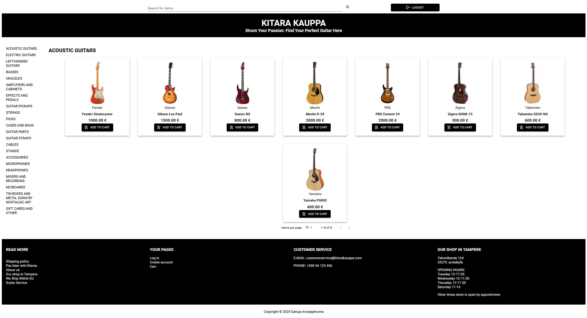
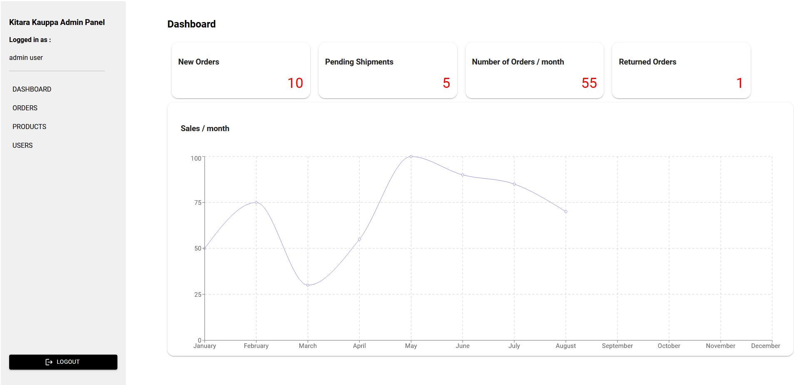

# Kirata Kauppa (Frontend)

## Tech Stack

## Production Ready URL : [https://main.d7b5s8hshsh29.amplifyapp.com](https://main.d7b5s8hshsh29.amplifyapp.com)

## Backend API Repository : [URL](https://github.com/sanuja-ariyapperuma/fs18_CSharp_FullStack_Backend)

## Installation and Getting started

1. Clone the project to the local repository
2. Run `npm install` to install dependencies

### Run as development

1. Run `npm run dev`

### Run as production

1. To build the project `npm run build`
2. Copy the build folder into the hosting folder (Apache/Nginx, Any Web Server, PaaS, Static Container)
3. point the `index.html` for the root path

## Features

1. Register as a customer
2. Login as an admin / customer

### Admin specific actions

1. List all products
2. Add products
3. Delete products
4. Update products
5. Dashboard for:
    
   &emsp; a. Monitor monthly sales as a graph
    
   &emsp; b. Check the count of new orders
    
   &emsp; c. Check the count of pending shipments
    
   &emsp; d. Check the count of orders for the current month
    
   &emsp; e. Check the count of returned orders
    
6. List all orders
7. Update orders status
8. List all users
9. Update user status
10. Check the dashboard as "Customer View"

## Application Screenshot

