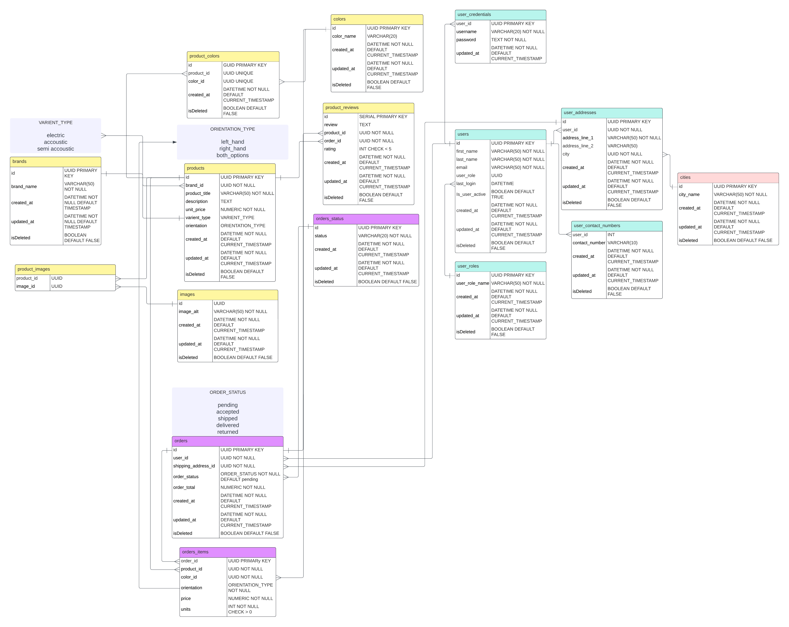

# Kitara Kauppa (The Guitar Shop): E-commerce App

<!-- 

 -->

### Backend

### Frontend

Kitara Kauppa, is an online guitar store which guitar enthusiastic can buy their dream guitars at a very reasonable price in Finland.

API Documentation URL : https://kitarakauppa.azurewebsites.net/swagger

Frontend App URL : https://main.d7b5s8hshsh29.amplifyapp.com

## Installation

1. Clone the project
2. Set the db connection string in appsetting.json
3. `dotnet run` to run the project

## Features

### Customer Specific

- List latest available guitars (as anonymous user)
- Check more details on each guitar (as anonymous user)
- Add / Remove guitars and accessories to / from the cart (as registered user)
- Purchase the orders (as registered user)
- Check the status of the order (as registered user)
- Have a review with your experience (as registered user)

### Admin Specific

- Add / remove users of the online store (Staff members)
- Make users active / inactive just in case
- Add new guitars and accessories or remove outdated or unavailable items
- Define / remove or update guitars and accessories categories
- Update the status of the orders
- Possibility of deleting reviews just in case

### Credentials

#### Admin

Username: admin@kk.com
 
Password: Abc123@@@

#### Customer

Username: sanuja@gmail.com
 
Password: Abc123@@@

## Sample Screenshot

## Architecture

### Technology Stack

### ER Diagram

### Demo Environment Architecture

### Production Application Architecture

### Dataflow Management

